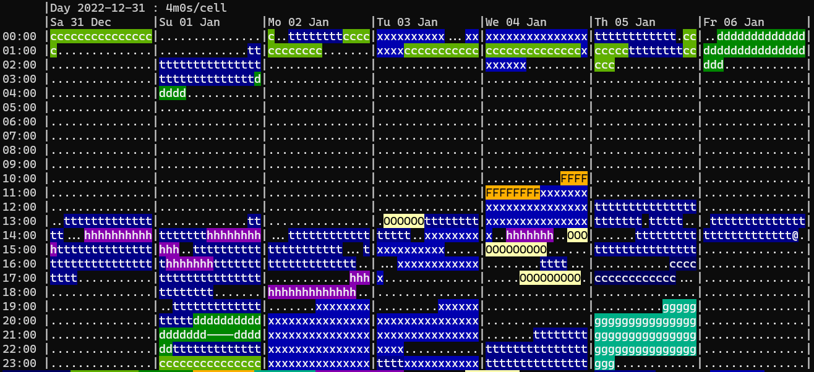

# Track

[](https://github.com/mlange-42/track/actions/workflows/tests.yml)
[](https://github.com/mlange-42/track)
[](https://mlange-42.github.io/track/)
[](https://github.com/mlange-42/track/blob/main/LICENSE)

Track is a time tracking command line tool.

*Track* is designed to be easy to use, and stores tracking entries in a human-readable plain-text format.

## Screenshots



## Features

* Track your working time from the command line
* Natural language-like syntax
* Supports hierarchical project structure
* Records stored as plain-text files for human readability and editing
* Different types of text-based and graphical reports

## Getting started

See the **[:blue_book: Track Documentation](https://mlange-42.github.io/track/)** for a comprehensive user guide!

### Installation

**Using Go:**

```shell
go install github.com/mlange-42/track@latest
```

**Without Go:**

Download binaries for your OS from the [Releases](https://github.com/mlange-42/track/releases/).

### Usage

Any time tracking `track` is associated to a *Project*.
Before you can start tracking, create a project:

```shell
track create project MyProject
```

Now, start tracking time on the project:

```shell
track start MyProject
```

To stop tracking, use:

```shell
track stop
```

Get information about the current tracking status:

```shell
track status
```

See the [:blue_book: Track Documentation](https://mlange-42.github.io/track/) for details and more commands.

## References

* Heavily inspired by [`timetrace`](https://github.com/dominikbraun/timetrace) and [`klog`](https://github.com/jotaen/klog)
