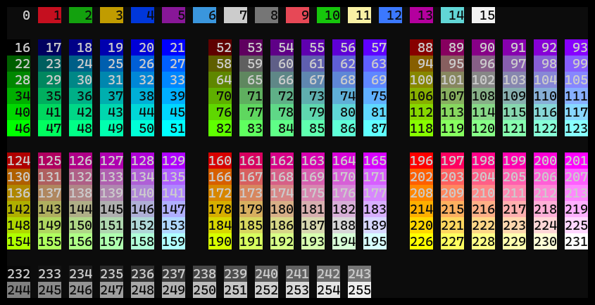

# Projects

Projects are the main way of structuring time tracking.
Each time tracking record is associated to a project.
For more high-level structuring, there are also [Workspaces](./workspaces.md).

[[_TOC_]]

## Project properties

A project has the following properties, as specified in it's YAML file:

```yaml
name: MyProject
parent: ParentProject
requiredTags: []
color: 0
fgColor: 15
symbol: M
archived: false
```

## Creating projects

Most simple, a project with default properties can be created like this:

```shell
track create project MyProject
```

To create a project with certain properties, use flags:

```shell
track create project MyProject --color 28 --symbol M
```

To list all available flags, see

```shell
track create project --help
```

For color values, see section [Colors](#colors).

## Nested projects

As the examples already showed, a project can have a parent project.
This way, hierarchies of projects with any depth of nesting can be created.

```shell
track create project Private
track create project Coding --parent Private
track create project MyApp --parent Coding
```

To view the project hierarchy, use:

```shell
track list projects
```

Gives:

```shell
<default>
└─Private         P
  └─Coding        C
    └─MyApp       M
```

For further ways to structure time tracking, see [Tags](./tracking.md#note-and-tags) and [Workspaces](./workspaces.md).

## Colors

For each project, a foreground and background color can be defined (`fgColor`, `color`).
*Track* uses 256 indexed terminal colors. To view the available colors, run:

```shell
track list colors
```

Which shows something like this:


*Available colors with indices*

## Required tags

In `requiredTags`, projects can define a list of tags that must be given for any record, with a value.
This feature can be used to enforce another layer or dimension of categorization, beyond projects.

E.g., *Track* projects could represent real-world projects, while a required tag holds information about the type of activity.
Here, a tag `activity` could be used with values like `writing`, `coding`, `meeting` etc.

## Editing projects

Project properties (except the project's name) can be changed at any time by editing the YAML file.
It is highly recommended to use *Track* for editing rather than to open the file directly:

```shell
track edit project MyProject
```

This way, the resulting project definition is checked before overwriting the project file.

For details, see chapter [Manipulating data](./manipulating.md).
